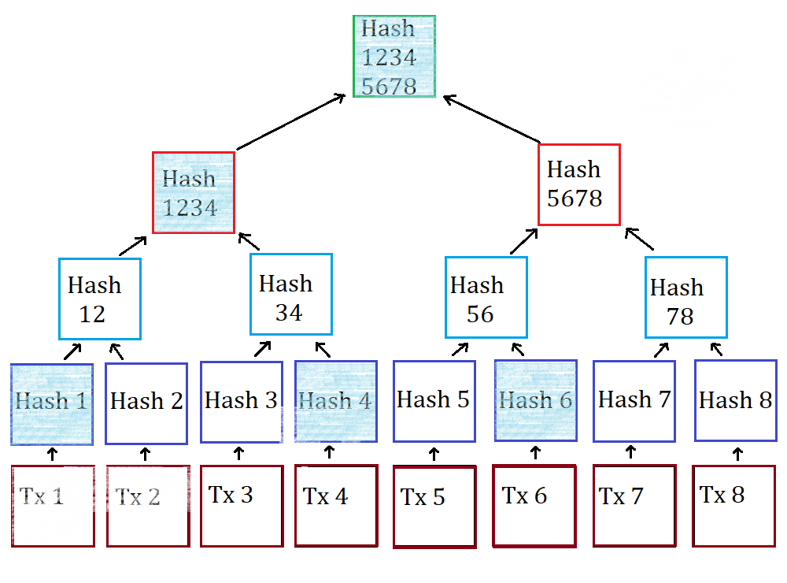

# Merkle Tree implementation in Java

This is an project to implement Merkle Tree implementation in java.

Merkle Trees are a cryptographic commitment scheme based on hashes. This particular implementation uses sha2_256
algorithm.
Merkle Trees are useful when we need to attest validity of something based on having only a small proof as well as cases
where we need to check whether dataset has not been tampered with (via root merkle hash verification).

A hash tree or Merkle tree is a tree in which every leaf node is labelled with the hash of a data block and every
non-leaf
node is labelled with the cryptographic hash of the labels of its child nodes.
Hash trees allow efficient and secure verification of the contents of large data structures.
Hash trees are a generalization of hash lists and hash chains.

## Requirements

- JDK (>= 17)
- maven (>= 3)

## Cloning

git clone https://github.com/jenny19919215/merkle-tree-solution.git

## Java Building

Java MerkleTree is located in `src/main/java`

```
cd merkle-tree-solution
mvn clean install
```

## Content

The project has implemented standard operations on Merkle trees:

```
  //Build a merkle tree by list of data
  MerkleTree tree = new MerkleTree(List.of("cat","dog","bird"));
  
  //Get merkle proofs of one leaf
  List<MerkleProof> merklePath = tree.getMerkleProof("leaf1");
  
  //verify the Merkle-proof
  public boolean verifyMerkleProof(String data, merklePath);
  
  //update merkle tree data synchronously
  public void updateLeaves(List<MerkleNode> modifiedLeaves, null);
  
  //update merkle tree data concurrently
  public void updateLeaves(List<MerkleNode> modifiedLeaves,  ExecutorService executors);  
  
```

Calculate conflict nodes for update leaves


